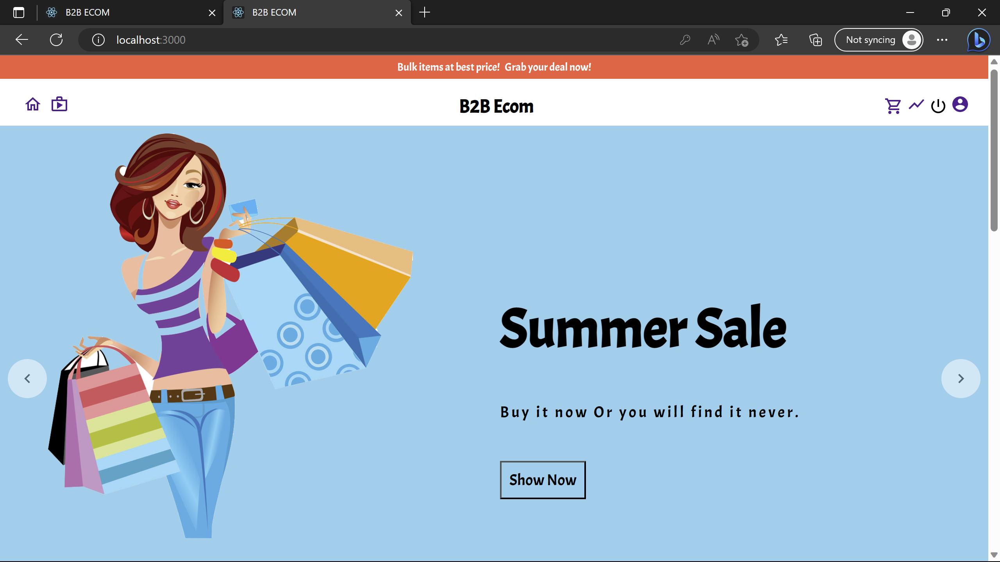
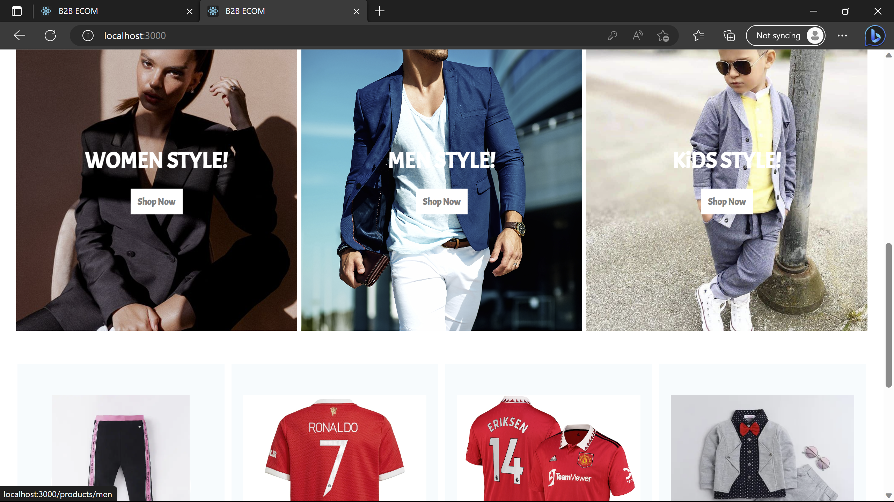

# B2B-Ecommerce

A fully responsive MERN application where Business owners can register themselves as Buyer(Client) or Seller(Admin) and buy or sell products in bulk. The Sales analytics of all the products are made available to Buyers where they can view the recent number of sales for their intrested product. 

## Prerequisites 
1. Node Js
2. MongoDB URL
3. Firebase Web Project Configuration 

<picture> </picture>
<picture> </picture>

## How to Run

1. After Cloning navigate to each folder(Client, API, Admin) via `cd <Folder_Name>` 
2. Install npm pakages by running the command `npm i` or `npm install --legacy-peer-deps`  
3. Run the command `npm start` in all the folders cmd to run the code. (For admin side navigate to '/login' to view the site.)
